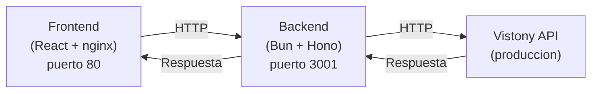

# Vistony API — Mock Integration

Plataforma interactiva para probar la **API de Vistony**: un servicio de analisis de material publicitario con inteligencia artificial. Sube imagenes de material POP, posters, estanterias o toldos y recibe analisis detallados con puntuacion, clasificacion y recomendaciones.

## Arquitectura



- **Frontend**: Aplicacion React con interfaz de 5 pestanas (Resumen, Subir, Analizar, Webhooks, Historial)
- **Backend**: Servidor proxy en Bun/Hono que reenvía las peticiones a la API real de Vistony
- **Sin base de datos**: los eventos de webhook se guardan en memoria (se pierden al reiniciar)

---

## Inicio Rapido con Docker

Esta es la forma mas sencilla de ejecutar el proyecto. Solo necesitas tener **Docker** instalado.

### 1. Instalar Docker

Si aun no tienes Docker instalado:

| Sistema Operativo | Instrucciones                                                                                    |
| ----------------- | ------------------------------------------------------------------------------------------------ |
| **Windows**       | Descarga [Docker Desktop para Windows](https://docs.docker.com/desktop/install/windows-install/) |
| **macOS**         | Descarga [Docker Desktop para Mac](https://docs.docker.com/desktop/install/mac-install/)         |
| **Linux**         | Sigue la [guia oficial para Linux](https://docs.docker.com/engine/install/)                      |

Para verificar que Docker esta instalado correctamente, abre una terminal y ejecuta:

```bash
docker --version
docker compose version
```

Ambos comandos deberian mostrar un numero de version.

### 2. Clonar el repositorio

```bash
git clone <url-del-repositorio>
cd mock-integration
```

### 3. Construir y ejecutar

```bash
docker compose up --build
```

La primera vez tardara unos minutos en descargar las imagenes y compilar. Las siguientes ejecuciones seran mucho mas rapidas gracias al cache de Docker.

### 4. Abrir la aplicacion

Abre tu navegador en: **http://localhost:3000**

Listo. La aplicacion esta corriendo.

### 5. Detener la aplicacion

Presiona `Ctrl + C` en la terminal donde esta corriendo, o desde otra terminal:

```bash
docker compose down
```

---

## Desarrollo Local (sin Docker)

Si prefieres ejecutar el proyecto directamente en tu maquina (util para hacer cambios en el codigo).

### Requisitos

- [Bun](https://bun.sh) (runtime de JavaScript/TypeScript)

Para instalar Bun:

```bash
# macOS / Linux
curl -fsSL https://bun.sh/install | bash

# Windows (PowerShell)
powershell -c "irm bun.sh/install.ps1 | iex"
```

Verifica que Bun se instalo correctamente:

```bash
bun --version
```

### macOS / Linux

```bash
# 1. Instalar dependencias
./dev.sh install

# 2. Iniciar ambos servicios
./dev.sh run
```

> Si obtienes un error de permisos, ejecuta primero: `chmod +x dev.sh`

### Windows (PowerShell)

```powershell
# 1. Instalar dependencias
.\dev.ps1 install

# 2. Iniciar ambos servicios
.\dev.ps1 run
```

> Si PowerShell bloquea la ejecucion del script, ejecuta primero:
> `Set-ExecutionPolicy -Scope CurrentUser -ExecutionPolicy RemoteSigned`

### Que hace cada comando

| Comando | Descripcion |
| ------- | ----------- |
| `install` | Ejecuta `bun install` en las carpetas `backend/` y `frontend/` |
| `run` | Inicia ambos servicios con hot reload (recarga automatica) |
| `help` | Muestra la ayuda del script |

Al ejecutar `run`, los servicios inician en:

- **Backend** en http://localhost:3001
- **Frontend** en http://localhost:5173

Los cambios en el codigo se reflejan al instante gracias al hot reload.

---

## Estructura del Proyecto

```
mock-integration/
├── backend/
│   ├── index.ts           # Servidor proxy (punto de entrada)
│   ├── package.json       # Dependencias del backend
│   ├── Dockerfile         # Imagen Docker del backend
│   └── .dockerignore
├── frontend/
│   ├── src/
│   │   ├── App.tsx        # Componente principal (pestanas)
│   │   ├── api.ts         # Cliente HTTP para llamar al backend
│   │   ├── main.tsx       # Punto de entrada React
│   │   ├── index.css      # Estilos globales
│   │   └── tabs/          # Componentes de cada pestana
│   │       ├── Overview.tsx
│   │       ├── Upload.tsx
│   │       ├── Analysis.tsx
│   │       ├── Webhook.tsx
│   │       └── History.tsx
│   ├── package.json       # Dependencias del frontend
│   ├── Dockerfile         # Imagen Docker del frontend (multi-stage)
│   ├── nginx.conf         # Configuracion de nginx (proxy reverso)
│   └── .dockerignore
├── docker-compose.yml     # Orquestacion de ambos servicios
├── dev.sh                 # Script de desarrollo (macOS/Linux)
├── dev.ps1                # Script de desarrollo (Windows PowerShell)
└── README.md              # Este archivo
```

---

## Endpoints de la API (Backend)

El backend expone estos endpoints en el puerto `3001`:

| Metodo   | Ruta                        | Descripcion                                     |
| -------- | --------------------------- | ----------------------------------------------- |
| `GET`    | `/`                         | Health check (estado del servicio)              |
| `POST`   | `/api/upload`               | Solicitar URL presignada para subir imagen a S3 |
| `POST`   | `/api/upload/:id/confirm`   | Confirmar que la imagen se subio correctamente  |
| `GET`    | `/api/files/:id`            | Obtener metadata de un archivo subido           |
| `POST`   | `/api/analyze`              | Enviar imagen para analisis con IA              |
| `GET`    | `/api/analyze/:jobId`       | Consultar estado de un analisis (polling)       |
| `GET`    | `/api/analyses`             | Listar historial de analisis (con paginacion)   |
| `POST`   | `/api/analyze/:jobId/retry` | Reintentar un analisis fallido                  |
| `GET`    | `/api/quota`                | Consultar cuota de uso de la API                |
| `POST`   | `/webhook`                  | Recibir notificaciones webhook de Vistony       |
| `GET`    | `/api/webhooks`             | Listar eventos webhook recibidos                |
| `DELETE` | `/api/webhooks`             | Limpiar eventos webhook almacenados             |

---

## Flujo de Uso

### Paso 1 — Subir una imagen

1. Ve a la pestana **"1. Subir Imagen"**
2. Selecciona un archivo de imagen (JPG, PNG, etc.)
3. El sistema obtiene una URL presignada de S3, sube el archivo y confirma la subida
4. Al terminar, obtienes la URL publica de la imagen

### Paso 2 — Analizar la imagen

1. Ve a la pestana **"2. Analizar"**
2. La URL de la imagen se llena automaticamente si subiste una en el paso anterior
3. Haz clic en **"Analizar"**
4. El sistema consulta periodicamente el estado (polling) hasta obtener resultados
5. Recibiras: clasificacion (tipo de material), puntuacion, retroalimentacion detallada y recomendaciones

### Paso 3 — Webhooks (opcional)

1. Ve a la pestana **"3. Webhooks"**
2. Aqui puedes ver las notificaciones que Vistony envia automaticamente cuando un analisis termina
3. Los webhooks son una alternativa al polling para recibir resultados

---

## Variables de Entorno

| Variable            | Donde se usa          | Valor por defecto       | Descripcion                                                          |
| ------------------- | --------------------- | ----------------------- | -------------------------------------------------------------------- |
| `VITE_API_BASE_URL` | Frontend (build time) | `http://localhost:3001` | URL base del backend. En Docker se usa `""` (misma origen via nginx) |

> **Nota**: La API key de Vistony esta incluida en el codigo del backend (`backend/index.ts`) para facilitar las pruebas. En un proyecto real, deberia estar en una variable de entorno.

---

## Solucion de Problemas

### Docker no arranca / "Cannot connect to Docker daemon"

Asegurate de que Docker Desktop esta abierto y corriendo. En Linux, verifica que el servicio esta activo:

```bash
sudo systemctl start docker
```

### "Port already in use" / El puerto esta ocupado

Si el puerto 3000 o 3001 ya esta en uso por otra aplicacion, puedes cambiar los puertos en `docker-compose.yml`:

```yaml
# Cambiar el puerto del frontend (ejemplo: usar 3000 en vez de 8080)
frontend:
  ports:
    - "9090:80"

# Cambiar el puerto del backend (ejemplo: usar 4000 en vez de 3001)
backend:
  ports:
    - "4000:3001"
```

### La aplicacion carga pero no muestra datos / errores de red

- Verifica que el backend esta corriendo: abre http://localhost:3001 (deberia responder `{"status":"ok"}`)
- Si usas Docker, revisa los logs: `docker compose logs backend`
- Si usas desarrollo local, asegurate de haber ejecutado `bun install` en ambas carpetas

### Quiero reconstruir todo desde cero

```bash
docker compose down
docker compose up --build --force-recreate
```

### Quiero limpiar todo (imagenes, cache, volumenes)

```bash
docker compose down --rmi all --volumes
```
